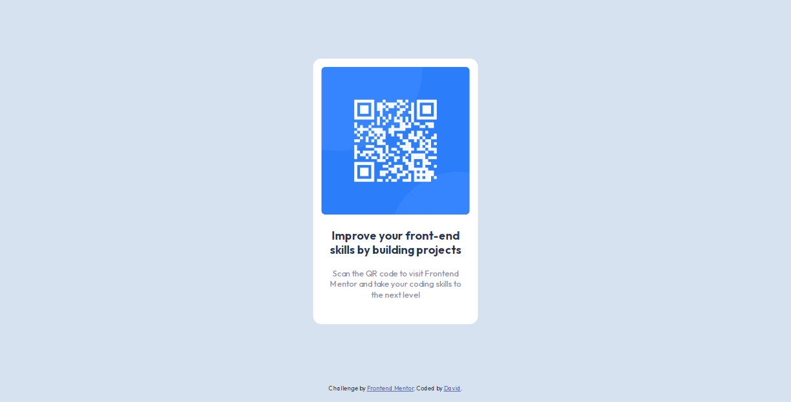

# Frontend Mentor - QR code component solution

This is a solution to the [QR code component challenge on Frontend Mentor](https://www.frontendmentor.io/challenges/qr-code-component-iux_sIO_H). Frontend Mentor challenges help you improve your coding skills by building realistic projects. 

## Table of contents

- [Overview](#overview)
  - [Screenshot](#screenshot)
  - [Links](#links)

## Overview

### Screenshot

#### PC demo

#### Mobile demo

### Links

- Solution URL: [https://www.frontendmentor.io/solutions/qr-code-component-using-flexbox-I7vMKQBJ0Y](https://www.frontendmentor.io/solutions/qr-code-component-using-flexbox-I7vMKQBJ0Y)
- Live Site URL: [https://normie614.github.io/frontendmentor-qr-code/](https://normie614.github.io/frontendmentor-qr-code/)
